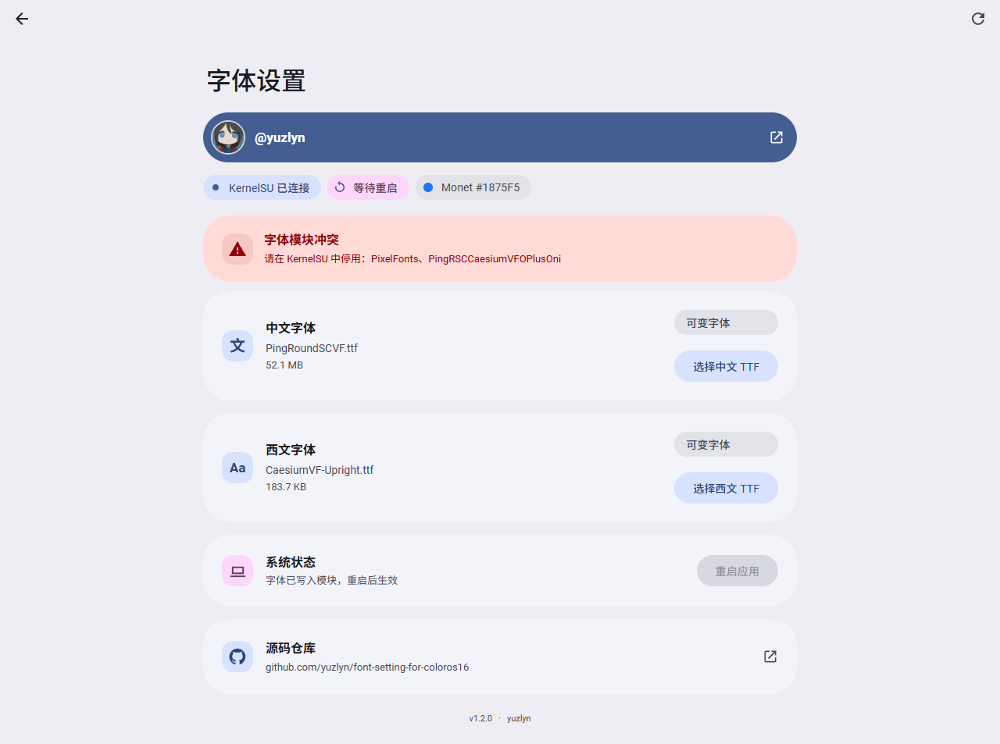
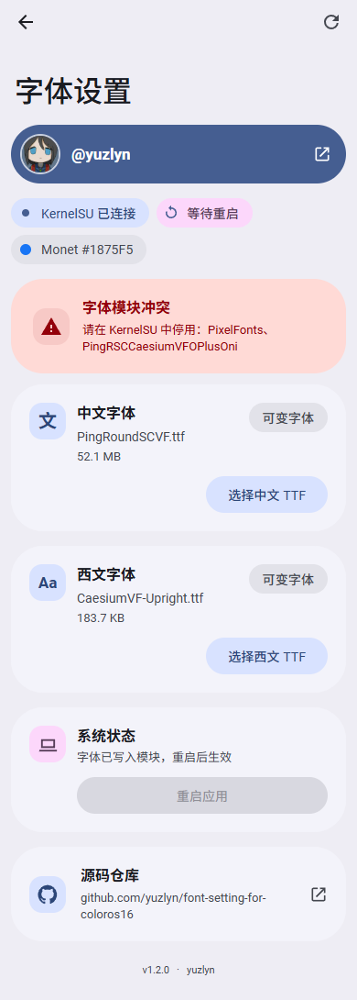

# font setting for coloros16

作者：**yuzlyn**  
版本：**v1.2.0**  
模块 ID：`font_setting_coloros16`

这是一个面向 ColorOS 16 的 KernelSU 字体模块。模块提供离线 WebUI，可分别上传中文和西文 `.ttf` 文件，并通过 KernelSU 的 systemless mount 替换字体映射，不直接修改系统分区。

## 下载

- 安装包：[font_setting_for_coloros16_v1.2.0_KSU.zip](./font_setting_for_coloros16_v1.2.0_KSU.zip)
- 文件大小：`32,808,079` 字节（约 31.3 MiB）
- SHA-256：`913B34DACE13A0C9719C2C8453532DAA7FAD4766FB3D43288B3ECCF78C95EC1E`

v1.2.0 按 Material 3 Expressive 设置页结构重构 WebUI：使用位置固定的 48dp Top App Bar 与文档流大标题；折叠态由 40dp 标题/图标和上下各 4dp 间隙组成，大标题完全没入顶栏后才弹入紧凑标题，顶栏本身不改变高度和位置。连接状态和 Monet 色值使用带前导状态图标的 AssistChip；字体区域改为带 40dp 图标容器的 ListItem-in-Card，并加入可动态更新的 Linear Wavy Progress Indicator。页面只读取系统 Monet 取色，不提供手动配色选择。标题下方提供使用真实 GitHub 头像的作者胶囊，页面底部提供源码仓库卡片；两者均指向 yuzlyn 对应的 GitHub 页面。

v1.1.0 使用系统 Monet 种子生成完整 Material Design 3 色板，支持 Tonal Spot / Neutral 切换，并重构 Surface Container 层级、阴影和紧凑排版。

v1.0.1 修复 KernelSU 3.2.4 新版三参数异步 `ksu.exec` 接口兼容问题，同时保留旧版同步接口回退。v1.0.0 会因提前读取尚未返回的执行结果而显示“KernelSU 连接失败”。

## 已验证环境

- 设备：OPPO PHY110
- 系统：ColorOS `16.0.7.200(CN01)`
- Android：16 / API 36
- KernelSU：`ksud 3.2.4`
- WebUI：MDUI `2.1.5` + Material Color Utilities `0.3.0`，全部资源已离线打包

模块安装脚本会检查 API 级别，非 Android 16（API 36）设备会中止安装。不同 ColorOS 16 版本的字体配置可能存在差异，刷入前应保留可用的 adb root 和 KernelSU 救援手段。

## 安装

1. 在 KernelSU 中停用其他字体替换模块，尤其是 `PixelFonts`、`TPTQ Ping Round SC + Caesium VF` 和 `tptq_and_googlesans`。
2. 在 KernelSU 模块页面安装 `font_setting_for_coloros16_v1.2.0_KSU.zip`。
3. 重启手机，使模块及内置默认字体首次生效。
4. 回到 KernelSU 模块页面，打开本模块的 WebUI。
5. 分别选择中文和西文 TTF，等待进度条完成。
6. 点击“重启应用”，重启后使用新字体。

如果 KernelSU 在首次重启前允许打开 WebUI，页面会自动优先访问 `/data/adb/modules_update/font_setting_coloros16`；重启后会自动回退到活动模块目录。

## 字体要求

- 仅选择扩展名为 `.ttf` 的 SFNT/TrueType 字体。
- 单个文件最大 `512 MB`。
- 中文字体应包含所需的简体和繁体字形；同一个中文文件同时用于 `zh-Hans` 与 `zh-Hant` fallback。
- 西文字体应包含拉丁字母、数字和常用标点。
- 页面会读取 `fvar` 表并识别 `wght` 可变轴。可变字体使用权重轴映射，静态字体使用 Android 合成权重。
- 页面只验证字体容器和表目录，不保证字体本身无损或字形完整。

模块初始内置 `PingRoundSCVF.ttf` 作为中文字体、`CaesiumVF-Upright.ttf` 作为西文字体，因此安装后即使还未上传自定义文件，字体配置也不会引用缺失文件。

## WebUI

页面使用 MDUI 提供的 Material Design 3 组件，包括 Top App Bar、Card、Chip、Button、Dialog 和 Snackbar。页面不依赖网络。

WebUI 通过 root bridge 读取 `theme_customization_overlay_packages` 中的 Monet `system_palette`。Web 端使用 Google Material Color Utilities 的 HCT 动态方案固定生成 `SchemeTonalSpot` 完整 token；Monet AssistChip 仅展示当前种子色和色值，不可点击或选择。

页面背景使用 `surface-container`，字体与系统卡片使用单一的 `surface-container-low` 大色块。卡片采用 35dp 圆角，不使用硬描边、内嵌白色内容层或阴影。字体类型 FilterChip 与分段按钮轨道使用 `surface-container-highest`；KernelSU 已连接状态使用 `primary-container` / `on-primary-container`；上传操作使用 Filled Tonal Button，并以 `primary-container` 提供强调层级。Chip、操作按钮和分段选择器均为 Full Shape。重启按钮禁用时使用 12% `onSurface` 背景和 38% `onSurface` 文字。亮色与暗色模式均直接使用 MaterialKolor 动态方案生成的对应 token。

上传字体时，对应字体卡片显示确定进度的波浪线；读取模块配置时，页面顶部显示不确定进度的动态波浪线。减少动态效果的系统偏好开启后，动画会自动降级。

中文字体使用“文”作为前导图标；西文字体使用纯西文 `Aa` 图标，不使用带中文“文”的翻译图标。





## 工作原理

- 西文字体映射到默认 `sans-serif`、`sys-sans-en` 和 `op-sans-en`。
- 中文字体映射到 ColorOS 的 `zh-Hans`、`zh-Hant` 和 `zh-Bopo` fallback。
- 模块包含静态/可变字体的四种 XML 组合，上传后自动选择匹配配置。
- 浏览器以 48 KiB 分块通过 KernelSU root bridge 写入临时文件。
- 提交时校验最终文件大小，再替换模块中的固定字体文件并同步两份字体 XML。
- 模块更新时，`customize.sh` 会保留此前上传的字体和元数据。
- 页面会提示已启用的已知字体替换模块，但不会自动停用或删除它们。

## 故障恢复

出现字体缺字、界面方框或无法正常启动时，先在 KernelSU 中停用本模块并重启。adb root 可用时，也可以执行：

```sh
adb shell su -c 'touch /data/adb/modules/font_setting_coloros16/disable'
adb reboot
```

如果 WebUI 显示“KernelSU 连接失败”，请确认页面是从 KernelSU 模块列表打开，而不是使用普通浏览器直接打开 `index.html`。

如果页面提示字体模块冲突，请停用提示中的模块后重启。`Font Loader` 仅提供字体预加载能力，不挂载字体 XML，因此不被视为冲突模块。

## 项目结构

```text
FontSetting_ColorOS16/
├── module.prop
├── customize.sh
├── post-fs-data.sh
├── service.sh
├── action.sh
├── config/                 # 四种静态/可变字体 XML
├── data/                   # 文件名、字体类型和待重启状态
├── system/
│   ├── etc/fonts.xml
│   ├── fonts/
│   │   ├── FontSettingChinese.ttf
│   │   └── FontSettingWestern.ttf
│   └── system_ext/etc/fonts_base.xml
├── tools/fontctl.sh        # 状态、上传、提交和配置切换
└── webroot/
    ├── index.html
    ├── app.js
    ├── assets/
    │   └── yuzlyn-github.png
    ├── styles.css
    └── vendor/             # 离线 MDUI、MaterialKolor 色板及许可证
```

## 构建与验证

安装构建依赖后生成字体配置和离线页面资源：

```powershell
npm.cmd ci --prefix .fontsetting-build --cache .npm-cache
node build-font-setting.mjs
node visual-check.mjs
```

在 `FontSetting_ColorOS16` 目录中使用支持 ZIP 的 bsdtar 打包，可确保 ZIP 内路径使用 Android 兼容的 `/`：

```powershell
tar -a -c -f ..\font_setting_for_coloros16_v1.2.0_KSU.zip *
```

本版本已完成以下检查：四份 XML 可解析；静态/可变轴数量符合配置；所有 shell 脚本通过设备 BusyBox `sh -n`；上传提交和 XML 切换在设备临时目录完成闭环；Monet 种子读取正确且页面不存在配色选择器；Monet AssistChip 不可交互；Surface Container 层级、状态色和控件色与动态 token 一致；卡片 35dp、无边框且无阴影；前导图标容器为 40dp；西文图标仅包含 `Aa`；作者头像成功离线加载且 GitHub 主页/源码仓库链接准确；Chip 和按钮为 Full Shape；顶栏固定为 48dp、标题上下间隙各 4dp，切换前后坐标及高度保持不变；波浪进度可正确映射 0-100% 数值；禁用按钮符合 12%/38% 透明度；390×844 与 1280×900 的亮色和暗色页面均无横向溢出；最终 ZIP 已通过 Android `unzip -t`。

## 许可与来源

- WebUI 使用 MDUI 2.1.5，MIT License 已包含在 `webroot/vendor/MDUI-LICENSE.txt`。
- 动态色板使用 Google Material Color Utilities 0.3.0，Apache License 2.0 已包含在 `webroot/vendor/MaterialColorUtilities-LICENSE.txt`。
- ColorOS 16 字体映射参考已安装的 `PixelFonts for ColorOS16` 与 `TPTQ Ping Round SC + Caesium VF` 模块。
- 使用或分发自定义字体前，请自行确认对应字体授权。
