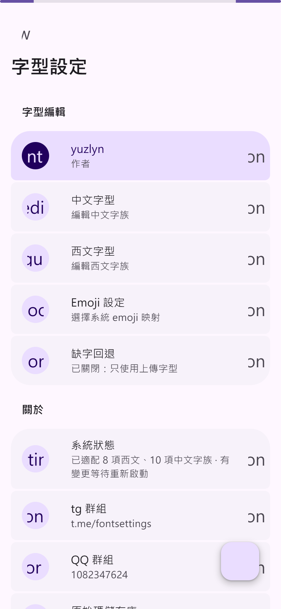
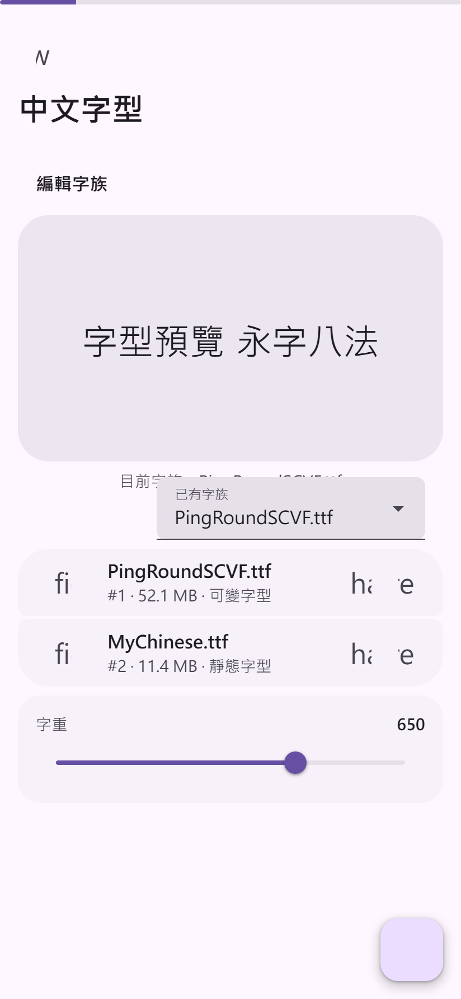
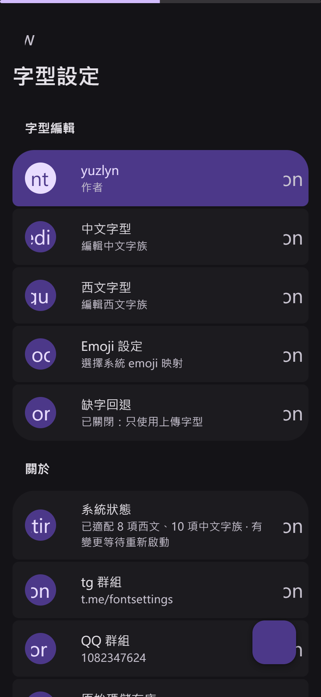

# Font Settings

- 作者：**yuzlyn**
- 版本：**v2.4.4**
- 模块 ID：`font-settings`

这是一个适用于 Android 8.0+ 的通用 KernelSU 字体模块，不限定手机品牌或 ROM。模块提供离线 WebUI，中文与西文各自可上传多个 `.ttf` 字体并按顺序组成 font-family 回退链（缺字自动回退，支持拖拽排序），上传可变字体后可调节 `100`–`900` 字重，并可选择内置 iOS、Google、Blobmoji、Facebook Emoji 或上传自定义 `.ttf/.otf`。所有替换均通过 KernelSU systemless mount 生效，不直接修改系统分区。

## 下载

- 完整包：[font-settings_v2.4.4_KSU.zip](https://github.com/yuzlyn/font-settings/releases/download/v2.4.4/font-settings_v2.4.4_KSU.zip)，`179,036,143` 字节，SHA-256：`53D36A2D23E37E80C18B483D3B898C92E55677CA91A43DD29827757BC5C56FAC`。
- 精简包：[font-settings_v2.4.4_lite_KSU.zip](https://github.com/yuzlyn/font-settings/releases/download/v2.4.4/font-settings_v2.4.4_lite_KSU.zip)，`33,315,416` 字节，SHA-256：`0DA1DC9B63C53051EFAC92A0E4AF6A9CB96F0EFEA21128F0FB1FB3A950F61462`；移除 iOS、Google、Blobmoji、Facebook 四套内置 Emoji，仍可保持系统默认或上传自定义 Emoji。

v2.4.4 修复 KernelSU 管理器里打开 WebUI 白屏。根因是界面脚本以 ES module（`<script type="module">`）加载：KernelSU 的静态资源处理器用**带查询串的文件名**猜 MIME（`app.js?v=243` 匹配不到已知扩展名），回退成 `text/plain`，而 ES module 在 MIME 不符时会被浏览器直接拒绝 → 白屏；同一份文件作为经典脚本则照常执行（旧版 MDUI 界面正是经典脚本，所以此前没暴露）。现在打包改为 IIFE 经典脚本（`--format=iife` + `<script defer>`），不再依赖宿主的 MIME 判定。同时新增 WebUI 自检：页面启动、bundle 执行、资源加载失败与未捕获异常都会写入 `/data/adb/font-settings/webui-error.log` 并在页面上显示可读错误；`service.sh` 开机还会清掉残留的 `update` 标记（它会让管理器一直显示"待更新"）并重置自检日志。

v2.4.3 修复 KernelSU 管理器闪退与升级丢失用户字体的共同根因。构建脚本在改写 `module.prop` 时写入了 UTF-8 BOM，安装器于是把模块 ID 读成 `<BOM>font-settings`：KernelSU 会看到两个模块目录、模块列表的 key 冲突导致管理器闪退（`IllegalArgumentException: Key "font-settings" was already used`），同时 `customize.sh` 的保留逻辑把用户字体写进了 BOM 目录，metamodule 再用干净包覆盖活动目录，字体就丢了。现在：`module.prop` 为无 BOM 的 UTF-8；`package-font-settings.ps1` 打包前校验 BOM 并拒绝打包；用户上传的字体与元数据同步到模块目录之外的持久备份 `/data/adb/font-settings/`（安装时由 `customize.sh` 恢复、开机由 `post-fs-data.sh` 补回），模块目录被整体替换也不会丢；内置 WebUI 服务改从稳定副本 `/data/adb/font-settings/webui` 提供（模块目录被替换后，运行中的 httpd 原本会因为工作目录失效而对所有请求返回 404）；`service.sh` 开机还会清理与活动版本相同的 `modules_update` 残留副本——它是管理器闪退的直接触发器。
v2.4.2 修复"WebUI 显示连线失败但命令其实可用"的情况。模块更新安装后 `modules_update/font-settings` 会与活动目录同时存在（部分 metamodule 会热应用更新并保留该目录），而其中的脚本可能还没有可执行位，界面却优先使用它，于是每条命令都返回 `Permission denied`、界面报连线失败。现在页面只会选择 `tools/fontctl.sh` 真正可执行的目录（优先已应用的更新目录，否则回退活动目录），并在遇到权限类错误时自动 `chmod` 两个候选目录后重试一次；`service.sh` 开机自愈也同时修复两个目录的权限。
v2.4.1 修复 v2.4.0 新界面"卡死 / 图标不显示 / 组件逻辑混乱"三个问题。**卡死**的根因是预览面板与路径导入会把整个字体文件经 root bridge 读进 WebView——一个 10 MB 的中文字体变成约 14 MB 的 JavaScript 字符串，WebView 直接卡住；现在预览面板只展示字族名称与元数据（大小、可变/静态、链序），路径导入改为 512 KiB 分块读取并显示进度，任何大对象都不再跨桥，`ui-smoke` 与 `live-check` 都加入了"零字体字节传输"的回归断言。**图标**改为把 Material Symbols Rounded 与 Roboto Flex 以 `data:` URI 内联进 `fonts.css`，不再受宿主对 `.woff2` 的 MIME 处理影响（KernelSU 与 KsuWebUI 对未知扩展名回退 `text/plain`）。**交互**简化：缺字回退改成列表行内开关（不再跳转独立页面）、菜单顶部新增连线/待重启/处理中状态标签与重新整理按钮、预览下拉只列出该角色真实存在的字族（系统预设 + 模块字体链），不再列出无法操作的设备字族。
v2.4.0 按 Material 3 Expressive 重写整个 WebUI。前端改为独立源码目录 `webui/`，用 esbuild 打包成单个离线 `app.js`，组件全部来自 Google 官方 Material Web（列表、FAB、下拉、对话框、滑杆、开关、输入框、进度），字体改为本地 `Roboto Flex` 可变字体与按需裁剪的 `Material Symbols Rounded`；页面结构变为 `字型設定` / `中文字型` / `西文字型` 三屏加 `Emoji 設定`、`缺字回退` 两个设置页，中文字型从右滑入、西文字型从左滑入，返回时反向播放（含系统返回手势）；新增 380×220dp 预览面板与「已有字族」exposed dropdown（选项来自字体链真实字体文件与设备字族），列表改为 M3 Expressive 分段样式（72dp 行高、3dp 间隔、28/8dp 圆角），重启 FAB 叠放在「關於」列表组上；配色改为「可取用系统强调色、取不到时回退到文档指定的紫色方案」，浅色/深色跟随系统。上传、删除、拖拽排序、字重/字号滑杆、Emoji 选择等原有功能保持不变，浏览器本地状态改用 IndexedDB 持久化。

v2.3.6 修复删除全部字体后无法恢复系统默认、个别用户重启不开机的问题。此前把所有中英文字体删除后，链为空时生成器仍会回退引用模块自带的默认字体文件（这些文件已随删除一并移除），生成的字型 XML 会指向不存在的文件，部分设备重启时因此卡在开机界面；同时删光字体也并不能真正回到系统默认（配置仍注入内置字体）。现在链为空时生成器原样输出设备原始字族——不引用任何缺失文件，重启后即为系统默认字体，WebUI 的计数处会提示“使用系统默认字体（重启后生效）”。另外修复了模块升级偶发丢失全部上传字体的问题：`customize.sh` 之前只在内置默认字体仍存在时才保留字体链，删除过默认字体的用户（链中只剩 `-N` 槽位文件）升级后上传字体被静默清空，现在只要模块目录里有任何已上传字体都会完整保留。

v2.3.5 修复个别设备安装后 WebUI 显示“KernelSU 连接失败”的问题。根因是安装时 `customize.sh` 未执行（模块文件保持打包时的默认权限），`tools/fontctl.sh` 与 `webroot/cgi-bin/exec` 没有可执行位，WebUI 每次调用都以“Permission denied”失败，同时字体配置备份与 Emoji/字号等设置也没有保留。现在 `service.sh` 开机后自愈：自动恢复关键脚本的可执行位，并在字体配置备份缺失时重新生成，即使安装过程异常也能保证 WebUI 正常连接。如果你的手机出现该症状，安装 v2.3.5 并重启一次即可恢复；已丢失的上传字体和 Emoji 设置需要重新上传。

v2.3.4 修复 v2.3.3 的两个问题，并让 Magisk 不依赖任何第三方应用即可打开 WebUI。KernelSU 官方 WebUI 与 KsuWebUIStandalone、MMRL 一样都从 `mui.kernelsu.org` 加载页面，因此 v2.3.3 按域名判断文件选择器不可用的做法会误伤 KernelSU，导致“添加字体”弹出路径导入对话框而不是系统选择器；现在改为动态探测——点击“添加字体”后先尝试打开系统选择器，只有宿主静默忽略（约 1 秒内没有任何页面可见性/取消/变更信号，典型是 Magisk 上的 KsuWebUIStandalone 或 MMRL）时才回退到路径导入对话框，KernelSU、APatch 原生 WebUI 和浏览器保持一键选择器。模块新增内置本机 WebUI 服务：开机后由 `service.sh` 用 busybox httpd 监听 `127.0.0.1:7125`，任何浏览器打开 `http://127.0.0.1:7125` 即可使用完整功能（页面在缺少 KernelSU bridge 时自动改用 `POST /cgi-bin/exec` 执行 root 命令）；Magisk 用户无需安装 KsuWebUIStandalone 或 MMRL，KernelSU 用户也可以直接在浏览器中操作。

v2.3.3 为可变字体新增字重选项。上传可变字体后，对应卡片会显示 `100`–`900` 的字重滑块（默认 `400`，与原行为一致）；调整后按槽位偏移重写字体 XML 的 `wght` 轴值（原槽位字重 + 设定字重 − 400，钳制在 `100`–`900`），粗细层级保留。此外为没有系统文件选择器的宿主准备了“从路径导入”对话框：粘贴字体绝对路径即可从设备直接读取并复用完整的校验、隔离与分块上传管线；v2.3.3 起初按页面域名切换该对话框，v2.3.4 起改为动态探测并默认保留系统选择器。

v2.3.2 优化上传字体速度：分块从 48 KiB 提高到 80 KiB（base64 编码后仍低于 `execve` 128 KiB 参数上限），并移除逐块动画帧等待；当 WebView 支持 `CompressionStream` 且设备 toybox 提供 `gzip` 时，分块先由浏览器 gzip 压缩、设备端以 `base64 -d | gzip -dc` 解压追加，传输量约减半，典型 20 MB 中文字体的桥接往返次数从约 430 次降到 130 次左右；任一端不支持时自动回退原始 base64 分块。字体隔离的 SFNT 校验和改为就地计算，不再为每个字体表分配对齐拷贝，降低大字体处理的内存峰值。

v2.3.1 修复“缺字回退”开启时，系统兜底字体与用户字体生成同名 `<family>`，导致部分设备默认 `sans-serif` 回退到系统字体、西文字体未生效的问题。现在系统兜底以未命名 `<family>` 追加在链末，用户字体始终优先。

v2.3.0 新增自组 font-family 多字体回退链。中文与西文各自可上传最多 8 个字体，在 WebUI 中拖拽排序，按顺序组成回退链；上传字体缺少的字形自动回退到后续字体。新增“缺字回退”开关，可决定是否在链末追加系统字体作为最终兜底。后端为每个链级字体生成独立的 `<family>`，并保留原字族字重与 `fallbackFor` 关系。

v2.2.7 将西文字号调节改为直接重写西文字体文件的 `head.unitsPerEm`，不再只依赖部分 ROM 可能忽略的字体 XML `size` 属性。上传西文字体和调整滑块都会重新生成缩放后的字体文件，范围为 `20%` 到 `100%`，默认 `100%`。

v2.2.6 将西文字号调节范围改为 `20%` 到 `80%`，默认值改为 `60%`，方便排查和缓解部分西文字体即使 `80%` 仍偏大的情况。

v2.2.5 新增西文字号调节。WebUI 可在 `80%` 到 `110%` 间调整西文字体 XML 的 `size` 属性，默认改为 `90%`，用于缓解部分西文字体字面过大、挤占相邻行导致显示混乱的问题。

v2.2.4 新增精简安装包，移除所有内置 Emoji 字体预设，显著减小下载体积；完整包仍保留全部 Emoji 预设。

v2.2.3 新增持久化 Monet 取色缓存。WebUI 在正文首次绘制前同步应用上次成功读取的系统种子，后台检测到种子相同则不重绘，只有系统取色变化时才更新色板与缓存；页面重新获得焦点或从后台返回时会再次检测，避免启动时先显示默认绿色再跳到系统取色。

v2.2.2 在上传阶段隔离中西文字形映射。导入中文字体时会屏蔽其中的拉丁字母、数字和西文标点映射，导入西文字体时会屏蔽其中的汉字、假名、谚文、注音及 CJK 标点映射；混合字体不再抢占另一个字族。处理过程保留原字形、OpenType 布局表和可变字体轴，并重新计算 SFNT 校验和。

v2.2.1 将模块、源码目录、GitHub 仓库和安装包统一改名为 `font-settings`。KernelSU 模块 ID 同步改为 `font-settings`，安装时会尝试从旧 ID `font_setting_coloros16` 迁移已上传字体、Emoji 选择和字体配置备份。

v2.2.0 在最底部新增“捐赠作者”卡片。点击后进入独立的 MD3 赞助页面，依次显示离线支付宝与微信支付二维码，两种支付方式之间使用分隔线，并在支付区下方显示“token支援”。

v2.1.0 在 WebUI 底部新增 Telegram 群组、QQ 群和关于卡片。Telegram 与 QQ 卡片支持长按复制群组信息；关于卡片打开模块内置、支持三语言与 Monet 主题的 README 页面。

v2.0.0 将模块改为通用动态适配架构。安装时读取设备实际存在的 `/system`、`/system_ext`、`/product` 和 `/vendor` 字体 XML，只改写默认西文字族与中文语言 fallback，并为静态或可变字体重新生成正确的节点。安装程序会验证中西文字族均已识别；不支持的私有配置会中止安装，不会套用其他 ROM 的 XML。

v1.5.0 新增 WebUI 多语言支持。系统语言为 `zh-TW` 时显示符合台湾惯用语的繁体中文；`zh-CN`、`zh-HK` 及其他中文区域显示简体中文；所有非中文系统语言统一回退到 `en-US`。页面标题、操作按钮、状态提示、错误消息、对话框和无障碍标签会一并切换。

v1.4.0 将 Emoji 平铺选项改为符合 MD3 Expressive 的当前值选择行与模态单选列表，并内置 iOS / Apple、Google / Pixel、经典果冻人和 Facebook 四款字体。

v1.3.0 新增 Emoji 设置卡片、自定义 `.ttf/.otf` 上传，以及基于系统字体 XML 和 `/system/fonts` 实际文件的动态目标检测。选择状态、自定义文件和目标记录会在模块更新时保留或重建。

v1.2.1 将字体上传和配置读取的自定义波浪进度条替换为 MDUI 的标准 Material 线性进度条，上传时显示确定进度，读取配置时显示默认不确定进度动画。

v1.2.0 按 Material 3 Expressive 设置页结构重构 WebUI：使用位置固定的 48dp Top App Bar 与文档流大标题；折叠态由 40dp 标题/图标和上下各 4dp 间隙组成，大标题完全没入顶栏后才弹入紧凑标题，顶栏本身不改变高度和位置。连接状态和 Monet 色值使用带前导状态图标的 AssistChip；字体区域改为带 40dp 图标容器的 ListItem-in-Card，并加入可动态更新的 Linear Wavy Progress Indicator。页面只读取系统 Monet 取色，不提供手动配色选择。标题下方提供使用真实 GitHub 头像的作者胶囊，页面底部提供源码仓库卡片；两者均指向 yuzlyn 对应的 GitHub 页面。

v1.1.0 使用系统 Monet 种子生成完整 Material Design 3 色板，支持 Tonal Spot / Neutral 切换，并重构 Surface Container 层级、阴影和紧凑排版。

v1.0.1 修复 KernelSU 3.2.4 新版三参数异步 `ksu.exec` 接口兼容问题，同时保留旧版同步接口回退。v1.0.0 会因提前读取尚未返回的执行结果而显示“KernelSU 连接失败”。

## 兼容范围

- Android：8.0 及以上（API 26+）
- Root：KernelSU 或提供兼容 KernelSU WebUI bridge 与 systemless 模块挂载的实现
- 字体配置：Android 标准 `familyset` / `fonts-modification` XML
- 已实机验证：OPPO PHY110、ColorOS `16.0.7.200(CN01)`、Android 16 / API 36、KernelSU `3.2.4`
- 已使用夹具验证：AOSP 默认 `sans-serif`、CJK TTC 索引、`system_ext` OEM 字族及 `product` locale customization

部分厂商可能使用未公开的字体服务或非标准配置。这类设备若无法识别中西文字族，安装程序会明确中止。刷入前仍应保留可用的 adb root 和 KernelSU 救援手段。

## 安装

1. 在 KernelSU 中停用其他字体替换模块，尤其是 `PixelFonts`、`TPTQ Ping Round SC + Caesium VF` 和 `tptq_and_googlesans`。
2. 在 KernelSU 模块页面安装完整包或精简包；两者不可同时安装。
3. 重启手机，使模块及内置默认字体首次生效。
4. 回到 KernelSU 模块页面，打开本模块的 WebUI。
5. 分别选择中文和西文 TTF（每个角色可添加多个字体，并在卡片内拖拽排序组成回退链），等待进度条完成。
6. 如西文字体偏大，可在“西文字号”滑块中调整比例；范围 `20%` 到 `100%`，默认 `100%`。
7. 上传可变字体后，可在对应卡片下方用“字重”滑块在 `100` 到 `900` 间调节字重，默认 `400`。
8. 在“Emoji 设置”中保持系统默认、选择一个可用内置预设，或上传自定义 `.ttf/.otf`。
9. 点击“重启手机”，重启后使用新字体与 Emoji。

如果 KernelSU 在首次重启前允许打开 WebUI，页面会自动优先访问 `/data/adb/modules_update/font-settings`；重启后会自动回退到活动模块目录。

Magisk 没有原生 WebUI 入口，本模块开机后会在本机 `127.0.0.1:7125` 启动内置 WebUI 服务：直接用手机关联的浏览器打开 `http://127.0.0.1:7125` 即可（页面在缺少 KernelSU bridge 时自动改用 `POST /cgi-bin/exec` 执行 root 命令），也可以继续使用 KsuWebUIStandalone 或 MMRL。在这类未实现文件选择器的宿主里点击“添加字体”，页面探测到系统选择器无响应后会弹出路径导入对话框：先在文件管理器中复制字体路径，再粘贴到对话框（如 `/sdcard/Download/font.ttf`）即可导入。

## 字体要求

- 仅选择扩展名为 `.ttf` 的 SFNT/TrueType 字体。
- 单个文件最大 `512 MB`。
- 中文与西文每个角色最多添加 `8` 个字体，按列表顺序组成回退链；链末是否追加系统字体由“缺字回退”开关控制。
- 中文字体应包含所需的简体和繁体字形；同一个中文文件同时用于 `zh-Hans` 与 `zh-Hant` fallback。
- 西文字体应包含拉丁字母、数字和常用标点。
- 页面会读取 `fvar` 表并识别 `wght` 可变轴。可变字体使用权重轴映射，支持 `100`–`900` 字重调节；静态字体使用 Android 合成权重。
- 页面会在上传前按角色过滤字体的 Unicode `cmap`：中文字体不提供西文映射，西文字体不提供中日韩映射。字体本身包含两类字形也不会跨角色覆盖。
- 页面只验证字体容器和表目录，不保证字体本身无损或字形完整。

## 内置 Emoji 文件

发布包内置以下 Android 兼容的彩色 Emoji SFNT 字体：

```text
font-settings/emoji/
├── ios/AppleColorEmoji.ttf
├── google/NotoColorEmoji.ttf
├── blobmoji/Blobmoji.ttf
└── facebook/Facebook-Emoji.ttf
```

四个文件均已验证为 SFNT，并包含 Android 可用的 `CBDT/CBLC` 彩色字形表。UI 仍会检测文件是否存在，构建损坏时对应项目会显示缺失并禁用。Apple 字体资源及图稿仍归 Apple Inc. 所有，分发前应自行确认使用范围。

字体来源：

- iOS / Apple：`https://github.com/samuelngs/apple-emoji-ttf` 的 `AppleColorEmoji-Linux.ttf` Release 资产。
- Google / Pixel：`https://raw.githubusercontent.com/googlefonts/noto-emoji/main/fonts/NotoColorEmoji.ttf`。
- 经典果冻人：`https://github.com/C1710/blobmoji/releases/latest/download/Blobmoji.ttf`。
- Facebook：`https://github.com/infofintech/typography/raw/main/Facebook-Emoji.ttf`。

模块初始内置 `PingRoundSCVF.ttf` 作为中文字体、`CaesiumVF-Upright.ttf` 作为西文字体，因此安装后即使还未上传自定义文件，字体配置也不会引用缺失文件。

## WebUI

WebUI 已按 Material 3 Expressive 重写，使用 Google 官方的 Material Web 组件（`md-list`、`md-list-item`、`md-fab`、`md-filled-select`、`md-dialog`、`md-slider`、`md-switch`、`md-outlined-text-field`、`md-linear-progress`、`md-icon-button`、`md-icon`），随模块离线打包，不依赖网络：组件与页面脚本由 esbuild 打成单个 `webroot/app.js`（约 360 KiB），字体与图标使用本地 `Roboto Flex`（latin / latin-ext 可变子集）与 `Material Symbols Rounded`（按用到的 37 个图标裁剪，约 45 KiB）。

目标是竖屏手机 `412×892dp`，所有颜色都通过 M3 角色引用。浏览器或系统能提供用户强调色时（KernelSU/Android 的 Monet `system_palette`，或用 `?seed=RRGGBB` 显式指定），页面用 Material Color Utilities 的 HCT `SchemeTonalSpot` 生成完整浅色/深色方案；取不到时保留文档指定的 Purple 备用配色（浅色 `primary #6750A4`、深色 `primary #D2BCFC`，`surface` 等角色同表）。浅色/深色跟随系统 `prefers-color-scheme`，切换时只更新 token，不重排页面。

共 3 个主屏幕加 2 个设置页：`字型設定`（分段列表：作者、中文字型、西文字型、Emoji 設定、缺字回退；關於區：系統狀態、tg 群組、QQ 群組、原始碼儲存庫、贊助作者）、`中文字型`、`西文字型`，以及 `Emoji 設定` 与 `缺字回退`。“中文字型”从右侧滑入、“西文字型”从左侧滑入，返回时反向播放同一段过渡（含系统返回手势／返回键），过渡使用 `MotionScheme.standard()` 的标准缓动与 400ms 时长，不回弹；开启“减少动态效果”时过渡降级为 1ms。

列表为 M3 Expressive 分段样式：行高 72dp、行间 3dp、组外圆角 28dp、相邻内侧圆角 8dp，行内 24dp 图标放在 40dp 的 `primaryContainer` 圆形上，作者一行整体使用 `primaryContainer` / `onPrimaryContainer`。重启按钮是叠放在「關於」列表组之上、垂直居中靠右的 `power_settings_new` 色调 FAB（`primaryContainer`，56dp／16dp 圆角，Level 3 阴影）；字体页的新增按钮是右下角悬浮的 `add` FAB。图标按钮为 56dp 圆形（M 尺寸），文字使用 Roboto Flex 的 emphasized 字重（标题 28sp / wght 700，区段标签 16sp / wght 600）。

字体页包含一个预览面板：`380×220dp` 的 `surfaceContainerHigh` 容器（28dp 圆角）显示样张，标签为「已有字族」的填充式 exposed dropdown（56dp 高，箭头 `arrow_drop_down`，展开项 48dp、`surfaceContainer`、4dp 圆角）横跨容器下缘并绘制在其前方。下拉选项只列出该角色真实存在的字族——系统预设与模块字体链，选择后显示该字族的名称、大小与类型（可变/静态，并标注链序）。面板不会从设备读取字体字节，因此瞬时响应、不会拖住界面。上传、删除、拖拽排序、字重与字号滑杆、缺字回退开关、Emoji 预设选择与 Emoji 自订上传都在新界面内完成；上传时页面显示线性进度，删除会先弹确认对话框并提示“删除全部字型会回到系统预设”。

浏览器本地状态（预览选择、最近的导入路径、设备字族与状态的缓存、本机活动记录）保存在 IndexedDB，重新载入后仍在；取不到数据时显示空状态与操作提示。当 WebUI 由未实现系统文件选择器的宿主承载（如 Magisk 上的 KsuWebUIStandalone 或 MMRL）时，点击“添加字体”与 Emoji“自定义文件”会先尝试打开系统选择器，宿主约 1 秒内无响应才弹出路径导入对话框：粘贴绝对路径即可从设备读取字体。







## 工作原理

- 安装时备份设备原始字体 XML，并记录实际存在的配置路径；更新模块时保留该备份，避免备份到模块自己的 overlay。
- 西文字体映射到系统默认 `sans-serif`、常见 OEM `sys-sans-en` / `op-sans-en`，以及旧 Android 的首个未命名字族。
- 中文字体只映射 `zh` / `yue` 语言 family，包括 `zh-Hans`、`zh-Hant`、`zh-Bopo` 等，不改写日文、韩文、Emoji、数学符号或 serif family。
- 生成器会移除原字体专属的 TTC `index`、PostScript 名称和轴声明；可变字体按原 XML 权重写入 `wght` 轴，静态字体交给 Android 合成权重。
- 回退链的每个字体生成一个独立的 `<family>`（首个保留原 `name`/`lang`，后续级别去掉 `name` 避免命名冲突），按列表顺序排列；开启“缺字回退”时在链末追加原始系统字族。Android 按 `<family>` 顺序做字形回退，因此缺字会依次落到后续字体。链只保留文件实际存在的字体；某个角色的字体全部删除后，生成器原样输出设备原始字族并停止注入该角色的字体（等于恢复系统默认，且不会引用已删除的文件）。
- 西文字号以 `data/western.size` 保存，范围限制为 `20` 到 `100`。WebUI 会通过调整西文字体 `head.unitsPerEm` 生成缩放后的字体文件，生成器也会为小于 `100` 的西文字体节点写入 Android 字体 XML 的 `size` 属性作为兼容补充。
- 可变字体字重以 `data/<role>.weight` 保存，范围 `100` 到 `900`，默认 `400`。生成器为可变字体的每个槽位把 `wght` 轴值改写为“原槽位字重 + 设定字重 − 400”并钳制到 `100`–`900`，静态字体节点不受影响。
- 浏览器以 80 KiB 分块通过 KernelSU root bridge 写入临时文件；两端都支持时使用 gzip 压缩传输（`base64 -d | gzip -dc` 解压追加），否则回退原始 base64 分块。分块大小保证编码后的指令长度低于 `execve` 的 128 KiB 参数上限。
- 路径导入时，页面先经 root bridge 以 `stat` 校验文件并以 `base64` 读回字节，再复用与系统选择器相同的校验、cmap 隔离与分块上传管线。
- `service.sh` 开机后启动内置 WebUI 服务：busybox httpd 只绑定 `127.0.0.1:7125`，根目录为模块目录之外的稳定副本 `/data/adb/font-settings/webui`（模块更新替换 webroot 时不会让运行中的守护进程失效）；busybox 依次探测 Magisk（`/data/adb/magisk/busybox`）、KernelSU（`/data/adb/ksu/bin/busybox`）与 APatch（`/data/adb/ap/bin/busybox`）位置。启动时还会自愈：恢复 `fontctl.sh`、`fontconfig.sh` 与 `cgi-bin/exec` 的可执行位、在字体配置备份缺失时重新捕获系统字体 XML、清理已应用版本残留的 `modules_update` 副本（否则 KernelSU 管理器会因模块重复而闪退）。
- 页面通过 `window.ksu` 探测桥接能力：缺少 KernelSU bridge（如用浏览器访问内置服务）时，自动改用 `POST http://127.0.0.1:7125/cgi-bin/exec`，由 busybox httpd 的 CGI 以 root 执行命令并返回“退出码 + 输出”。
- 点击“添加字体”先尝试系统文件选择器；宿主约 1 秒内没有任何页面可见性/取消/变更信号（未实现 `onShowFileChooser`）时才回退到路径导入对话框。
- 上传前由浏览器重建字体的 Unicode `cmap` 并重算 SFNT 校验和；其他字体表和字形数据保持不变。
- 提交时校验最终文件大小，把新字体写入空闲槽位（`FontSetting<Role>-<n>.ttf`）并追加到对应角色的 `data/<role>.list`，再从设备原始备份重新生成所有已识别的字体 XML。
- Emoji 应用时依次读取 Android 字体 XML 中首个未标记 `ignore="true"` 的 `und-Zsye` family，并确认对应文件实际存在于 `/system/fonts`。XML 不可用时回退扫描 `NotoColorEmoji.ttf`、`SamsungColorEmoji.ttf`、`NotoColorEmojiLegacy.ttf` 及其他 Emoji `.ttf/.otf`。
- 检测会跳过 `Flags` 和 `Compat` 字体，避免把主 Emoji 字体错误覆盖到独立旗帜或兼容补充字体。目标文件名保存在 `data/emoji.targets`，选择“保持默认”时只删除本模块记录的覆盖文件。
- 选定字体会复制并重命名为 `system/fonts/<检测到的文件名>`，由 KernelSU OverlayFS/挂载机制在下次启动覆盖系统同名文件。
- 模块更新时，`customize.sh` 会保留此前上传的字体和元数据。
- 页面会扫描已启用模块的字体 XML 和字体文件 overlay 并提示冲突，但不会自动停用或删除其他模块。

## 故障恢复

出现字体缺字、界面方框或无法正常启动时，先在 KernelSU 中停用本模块并重启。adb root 可用时，也可以执行：

```sh
adb shell su -c 'touch /data/adb/modules/font-settings/disable'
adb reboot
```

如果 WebUI 顶部显示「連線失敗」：先点右上角的重新整理；仍失败时确认模块目录内的 `tools/fontctl.sh` 可执行（v2.4.3 起页面会自动修复权限并重试一次），或改用手机浏览器打开 `http://127.0.0.1:7125`（模块内置服务，不依赖任何宿主应用）。

如果页面提示字体模块冲突，请停用提示中的模块后重启。`Font Loader` 仅提供字体预加载能力，不挂载字体 XML，因此不被视为冲突模块。

如果 KernelSU 管理器打开就闪退，并在崩溃日志里看到 `IllegalArgumentException: Key "font-settings" was already used`，说明模块同时存在于 `modules/` 与 `modules_update/`，管理器把模块列了两次。重启一次（或删除 `/data/adb/modules_update/font-settings`）即可恢复；v2.4.3 起 `service.sh` 会在开机时自动清理这种已应用版本的残留副本。

如果升级后发现上传的字体没了：v2.4.3 起上传的字体与元数据会同步到 `/data/adb/font-settings/`，升级时会自动恢复；该目录也可作为卸载前的备份来源。

## 项目结构

```text
font-settings/
├── module.prop
├── customize.sh
├── post-fs-data.sh
├── service.sh
├── action.sh
├── config/original/        # 安装时生成的设备原始字体 XML 备份
├── data/                   # 字体链清单 <role>.list、映射数量、Emoji 状态、字号、字重与待重启状态
├── emoji/
│   ├── ios/AppleColorEmoji.ttf
│   ├── google/NotoColorEmoji.ttf
│   ├── blobmoji/Blobmoji.ttf
│   └── facebook/Facebook-Emoji.ttf
├── system/
│   ├── fonts/
│   │   ├── FontSettingChinese.ttf    # 中文字体链（-1/-2... 为追加槽位）
│   │   ├── FontSettingWestern.ttf    # 西文字体链（-1/-2... 为追加槽位）
│   └── <动态生成的设备字体 XML>
├── tools/
│   ├── fontctl.sh          # 状态、上传、提交、删除、排序、替换和 Emoji 切换
│   ├── fontconfig.sh       # 捕获并生成设备字体配置
│   └── fontxml.awk         # family 级 XML 转换器（按回退链生成多个 family）
└── webroot/
    ├── index.html          # 生成的页面外壳（引用 app.js / styles.css / assets/fonts）
    ├── app.js              # esbuild 打包产物：应用 + Material Web 组件（约 360 KiB）
    ├── styles.css          # M3 token 层、字体样式、动效与布局
    ├── font-isolation.js  # 中西文 cmap 隔离与 SFNT 重建
    ├── theme-cache.js     # 关于页的 Monet 缓存工具（主界面已改用 webui/src/theme.js）
    ├── about.html          # 内置 README 关于页面
    ├── about.js
    ├── about.css
    ├── donate.html         # 支付宝与微信支付捐赠页面
    ├── donate.css
    ├── assets/
    │   ├── fonts/          # Roboto Flex 与 Material Symbols Rounded 离线子集
    │   ├── alipay.jpg
    │   ├── wechat.png
    │   └── yuzlyn-github.png
    ├── cgi-bin/
    │   └── exec            # 内置 WebUI 服务的 root 命令执行端点（POST 命令，返回退出码+输出）
    └── vendor/             # MaterialKolor 色板与许可证（MDUI 仅供 about/donate 页面使用）

webui/                       # 前端源码（构建到 font-settings/webroot）
├── build.mjs                # 生产构建：esbuild 打包 + 资源复制 + 版本注入
├── src/
│   ├── index.html           # 页面外壳模板（__VERSION__ 由构建替换）
│   ├── app.js               # 应用外壳：路由、动效、动作与桥接接线
│   ├── theme.js             # 动态配色（系统强调色 → M3 方案，回退到紫色）
│   ├── bridge.js            # ksu / HTTP 双通道 root 命令桥
│   ├── module-api.js        # fontctl 封装、上传管线、字体校验、设备字族枚举
│   ├── store.js             # IndexedDB 本地状态（预览、路径、缓存、活动记录）
│   ├── ui.js                # 对话框、snackbar、列表组、滑杆等 UI 辅助
│   ├── screens/             # menu / role（中文·西文）/ emoji / fallback
│   ├── components/          # 预览面板（380×220 容器 + exposed dropdown）
│   └── assets/fonts/        # 离线字体与其 @font-face 样式表
└── tests/
    ├── ui-smoke.mjs         # 无头冒烟测试（35 项断言，含配色、版式、动效与交互）
    └── screenshots.mjs      # 生成浅色/深色各屏幕截图，便于设计复核
```

## 构建与验证

安装构建依赖后生成内置字体与离线页面资源，并构建前端：

```powershell
npm.cmd ci --prefix .fontsetting-build --cache .npm-cache
node build-font-setting.mjs       # 内置字体、MaterialKolor 色板与 MDUI 资源
node webui/build.mjs              # 生产构建：打包 WebUI 到 font-settings/webroot
node tests/font-isolation-test.cjs
node tests/upload-transfer-test.cjs
node webui/tests/ui-smoke.mjs     # 无头界面冒烟测试（35 项断言）
```

需要复核视觉时用 `node webui/tests/screenshots.mjs`（输出到 `webui/.screenshots/`，浅色与深色各屏幕）。真机验证模块自带 WebUI 服务时，用设备上的 busybox httpd 托管构建产物再跑 `node webui/tests/device-check.mjs`（需先 `adb forward tcp:7131 tcp:7131`），它会检查设备实际返回的 MIME、离线字体加载、图标连字与首屏结构；`node webui/tests/live-check.mjs` 则在 `adb forward tcp:7125 tcp:7125` 后直接对真机运行中的 WebUI 服务做端到端校验（真实 root 桥、真实字体链数据）。字体配置转换器夹具测试需要在 Android shell 中运行：

```sh
sh tests/fontconfig-test.sh
```

使用 `package-font-settings.ps1` 分别打包完整版与精简版（内部使用支持 ZIP 的 bsdtar，确保 ZIP 内路径使用 Android 兼容的 `/`）：

```powershell
.\package-font-settings.ps1 -Edition full
.\package-font-settings.ps1 -Edition lite
```

本版本已在 OPPO PHY110（Android 16 / API 36 / KernelSU 3.2.4）实机验证：动态生成的字体配置可解析且 magic mount 生效、无 minikin/font 报错；中英文字体链的添加、删除、排序与缺字回退后端命令均通过；字重偏移、钳制与非法值回退通过 fontconfig 夹具测试，`weight-set` 写入、状态回读与字体配置重生成在设备上验证；“删除全部字体恢复系统默认”用例通过夹具验证（生成结果与原设备配置逐字节一致、零 `FontSetting` 引用），单角色清空另一角色保留的混合场景同样通过，模块升级保留仅含 `-N` 槽位的字体链在设备上实测；内置 WebUI 服务与 `service.sh` 自愈流程在真实“安装异常”现场验证；v2.4.0 的界面在 412×892dp 视口以 `node webui/tests/ui-smoke.mjs` 验证（列表结构、动效类、预览面板叠加关系、56dp 圆形图标按钮、强调字重、离线字体加载、深浅色 token 与系统回退配色、无横向溢出、后退手势等 35 项断言，浅色与深色各跑一遍）；所有 shell 脚本通过 `sh -n` 语法检查。

## 许可与来源

- 界面组件使用 Google Material Web 2.4.0（Apache License 2.0）；`about` 与 `donate` 页面仍使用 MDUI 2.1.5（MIT License，`webroot/vendor/MDUI-LICENSE.txt`）。
- 字体：Roboto Flex 与 Material Symbols Rounded 取自 Google Fonts，Apache License 2.0，已按用到的字符与图标子集化，并在构建时以 `data:` URI 内联进 `webroot/assets/fonts/fonts.css`（不依赖宿主对 `.woff2` 的 MIME 处理）。
- 动态色板使用 Google Material Color Utilities 0.3.0，Apache License 2.0 已包含在 `webroot/vendor/MaterialColorUtilities-LICENSE.txt`。
- 动态生成器只使用安装设备自身的 Android 字体配置，不再内置或分发任何特定 ROM 的 XML。
- 使用或分发自定义字体前，请自行确认对应字体授权。